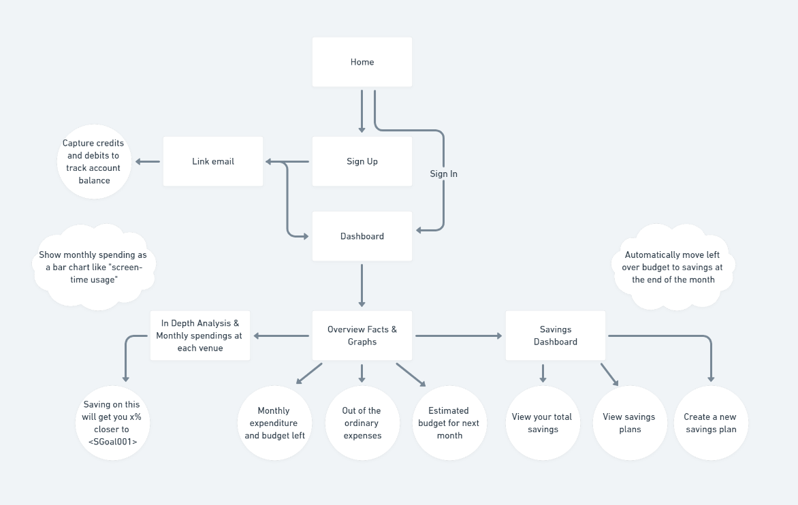

# SquirrelAway 🐿️

## 💡 Inspiration

Saving money can be hard, especially when you're on a budget. Krishna and I were talking the other day about how long it takes to save up for a Macbook (lol) and we started to think of ways to cut down on unnecessary expenses. But we just couldn't think of any - we were sure we had a lot of frivolous sprees in the past few months but nothing would come to mind. We then concluded that there should be an app or something that could keep track of your expenses **automatically** (since entering them manually in a finance tracker is a lot of work), and would hold us accountable and make us put in a second thought before we make bad purchases. So - this weekend at HooHacks, we built just that!

## 🔮 What it does

Squirrel Away is a mobile application that helps you save and be on top of your finance game just as well as a squirrel does. [Relevant Clip](https://youtu.be/cZkAP-CQlhA?t=25) There are tons of finance trackers that exist but they all have one catch - you gotta track it yourself. With SquirrelAway, you don't need to. Connect with your Google Account, and our little squirrels will check (read: parse) your emails for any banking transactions that you may perform. Here's a breakdown of all the features we offer.

### Dashboard 🎯

Get a quick overview of your monthly expenditure and budget left until the end of the month.

### Savings 💰

Set up simple goals to save money towards something you need personally. You can also save up money as a group to invest in something huge! Personal goals are directly tracked by your savings. Savings Groups have a bunch of people pitching in for a common goal, like maybe a new television.

### Erratic Spendings 💸

By clustering your purchase values we figure out a certain range that your transactions normally occur in. Anything out of the ordinary, or erratic, will be shown up here so you know exactly where you spent that $899 last Friday. 🥴

### Analysis 🕵️

We analyze your monthly purchases to figure out which top three vendors are making you go broke by the 2nd week of the month. We also show you how saving on even just one of those purchases could've gotten you an X% closer to that sweet sweet new Boosted Board.

### Predictions 🔮🔮🔮

We keep track of your spendings throughout the month and help make predictions on how much more money you will need to get by this month. We also show you if you ended up spending lesser or more money compared to previous months. Do you pay $500 every last Friday for rent? It's automatically accounted for since it's a repetitive pattern. $50 every third month for improv class? Yep, that too. 💫

## 🛠️ How we built it

We first used Whimsical to design our application and create a wireframe. We then used React Native for the frontend, paired with a NodeJS backend server. We wrote our CSS but used a UI Library called UI Kitten. We had a whale of a time with this stack!

## 🚧 Challenges we ran into

This was the first time we used React Native for an app with these many features and complex patterns. Three of us are absolute beginners with React Native (1 with React itself), so it was a fun yet challenging experience to pull this off. We also tried out a new UI library, which we ended up enjoying a lot. (UI Kitten)

## 🥰 Accomplishments that we're proud of

We were able to recreate RN screens exactly like we planned out in the wireframes so we're proud of that and are very happy with the results. Plus, the app works as intended, so that's always great! We were able to encapsulate a large number of screens and features in a short time by diving workload efficiently and by working in opposite time zones.

## 📚 What we learned

We learned a lot about how mobile apps work. This was the first hackathon for half of our team, so we also learned how to work with people remotely and communicate asynchronously. We learned how to demo and pitch our app, and of course, we learned a whole lot of JavaScript and React Native.

## 🚀 What's next for Squirrel Away

We understand that not every purchase can be avoided and not every purchase is frivolous, so in the coming future, we want to add a `blacklist vendor` feature that helps you hide necessary purchases and only keep track of the ones you can work on cutting down on. We also plan to incorporate Machine Learning algorithms to enhance the email parsing, clustering, and prediction features of the application.

We had a great time building SquirrelAway and we hope you enjoyed this little hack! 🐿️🐿️🐿️
